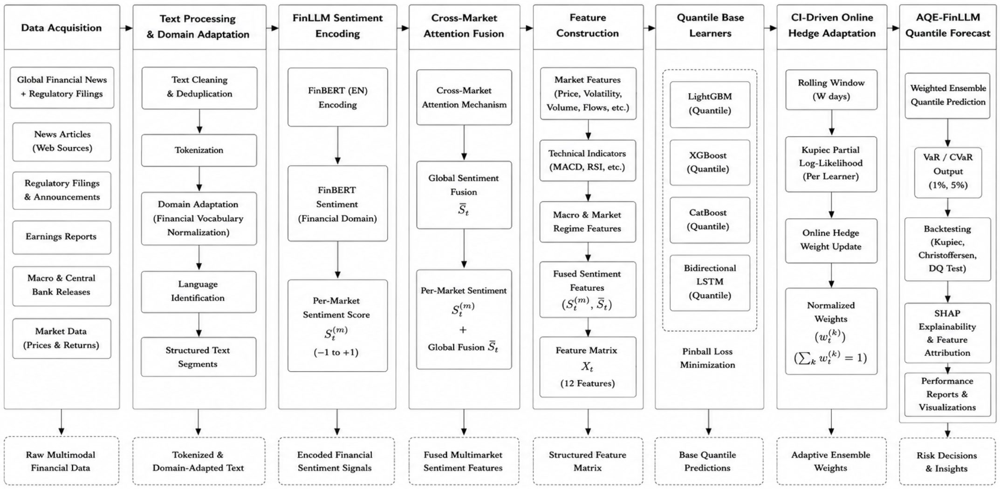

# AQE-FinLLM: Adaptive Quantile Ensemble with Multimarket LLM Sentiment Fusion
Cross-Market Tail Risk Estimation |  **CIFEr 2026** 

---
## Markets Evaluated with MARKET_KEYWORDS
```bash
SP500(`^GSPC`)       : ["S&P", "SPX", "Fed", "Federal Reserve", "Wall Street", "SEC", ...]
NIKKEI(`^N225`)      : ["Nikkei", "BOJ", "Bank of Japan", "Tokyo Stock", "Yen", ...]
BITCOIN(`BTC-USD`)   : ["Bitcoin", "BTC", "crypto", "FTX", "Ethereum", ...]
NIFTY50(`^NSEI`)     : ["Nifty", "NSE", "Sensex", "SEBI", "RBI", "rupee", ...]
BANKNIFTY(`^NSEBANK`): ["Bank Nifty", "HDFC", "ICICI", "SBI", "Axis Bank", ...]
```

## Repository Structure

```
aqe_finllm/
├── data/
│   ├── fetch_market_data.py      # yfinance + NSEPython + FX ingestion
│   ├── fetch_sentiment.py        # FinBERT corpus pipeline
│   ├── build_corpus.py
│   ├── normalize_corpus.py       # Dataset normalizer
│   └── readme.md
├── modules/
│   ├── module_a_finllm.py        # Stage 1-3: tokenize → encode → fuse
│   ├── module_b_base_learners.py # LightGBM, XGBoost, CatBoost, BiLSTM
│   ├── module_c_hedge_ensemble.py# Online Hedge weighting + CVaR
│   └── module_d_cqr.py           # Conformal Quantile Regression
├── backtesting/
│   └── backtest_suite.py         # Kupiec, Christoffersen, DQ, DM tests
├── utils/
│   ├── features.py               # All 12 features + ADF stationarity
│   ├── pinball.py                # Pinball loss + Chernozhukov rearrangement
│   └── shap_explainer.py         # SHAP + interaction decomposition
├── notebooks/
│   └── full_pipeline_demo.ipynb  # End-to-end Colab-ready demo
├── main.py                       # Orchestrator — run full pipeline
├── config.py                     # All hyperparameters, markets, paths
├── requirements.txt
└── README.md
```

## Architecture


```bash
1. Raw Market Data + Financial News
2. FinBERT Sentiment Pipeline
3. 12-Feature Engineering
4. Quantile ML Models (4)
5. Adaptive Hedge Ensemble
6. Conformal Calibration (CQR)
7. VaR / CVaR Forecasts
8. Backtesting + SHAP Explainability
```

## Dataset

Download both datasets from Kaggle, unzip, place CSVs in project root AQE-FINLLM, Downloaded Kaggle datasets with renaming already available in project repository for reference
```bash
Kaggle 2008–2024, daily headlines,
URL:  kaggle.com/datasets/dyutidasmahaptra/s-and-p-500-with-financial-news-headlines-20082024

Kaggle Full-text Indian financial news,2003–2020 (Economic Times)
URL:  https://www.kaggle.com/datasets/hkapoor/indian-financial-news-articles-20032020

    Rename them to:
      sp500_headlines_2008_2024.csv
      nifty_news_2003_2020.csv
```

## Run pipeline 

```bash
python -m venv .venv
.venv\Scripts\activate.ps1
pip install -r requirements.txt
pip install feedparser
pip install fugashi unidic-lite
# Optional as repo already contains these normalized data
python -m data.build_corpus        # rss_live.csv
python -m data.normalize_corpus    # articles.csv (RSS merged)
# ONE-TIME sentiment Module A + FinBERT (optional as it takes too much time)
python -m data.fetch_sentiment --input articles.csv --output data\cache\
python -m data.fetch_market_data
# RUN PIPELINE (market data + Modules B/C/D + backtest)
python main.py --market NIFTY50
```
---
## Note: 

Here authors have given option to skip datasets if one want to run model only on kaggle downloaded dataset can skip real time news fetching, normalize just prints (skip) not found: rss_live.csv and proceeds with Kaggle only. If you skip Kaggle, it uses RSS only. Any combination works it merges whatever exists. One command auto pull (if you want RSS fetched automatically every run)


Add this near the top of normalize_corpus.py's main(), right after args = parser.parse_args():
```bash
# Auto-refresh live RSS before combining (best-effort, non-fatal)
    if not args.input:
        try:
            from data.build_corpus import fetch_feed, FEEDS
            import pandas as _pd
            rows = []
            for _name, _url in FEEDS.items():
                rows.extend(fetch_feed(_name, _url))
            if rows:
                _df = _pd.DataFrame(rows)[["date", "text"]]
                _df.to_csv(_PROJECT_ROOT / "rss_live.csv", index=False)
                print(f"[normalize] Auto-pulled {len(_df)} live RSS rows")
        except Exception as e:
            print(f"[normalize] RSS auto-pull skipped: {e}")
```
Then a single python -m data.normalize_corpus pulls fresh RSS and merges with Kaggle in one shot. Requires build_corpus.py's fetch_feed/FEEDS to be importable (they already are if you applied the earlier sys.path pattern).

##  Optional, anytime pull fresh live news
python -m data.build_corpus                 # -> rss_live.csv

##  combine ALL available sources (Kaggle history + RSS live)
python -m data.normalize_corpus             # -> articles.csv

##  sentiment + pipeline
python -m data.fetch_sentiment --input articles.csv --output data\cache\
python main.py --market NIFTY50

## Run ONCE (slow, needs news corpus + FinBERT)
Run FinBERT over the combined corpus
python -m data.fetch_sentiment

## What fetch_sentiment.py triggers
```bash
python -m data.fetch_sentiment
   │
   └─ imports modules/module_a_finllm.py        ← Module A runs HERE
        ├─ build_corpus_partition()   (tags articles → markets)
        ├─ FinBERTEncoder("en")       (loads FinBERT, downloads weights)
        ├─ FinBERTEncoder("ja")       (loads FinBERT-ja)
        └─ aggregate_daily_sentiment() (runs FinBERT inference)
   │
   └─ writes  data/cache/sentiment_NIFTY50.csv
              data/cache/sentiment_SP500.csv
              ... etc
              data/cache/sentiment_global.csv
```
Module A is the only module that runs in the other entry point (fetch_sentiment), because FinBERT is slow and you don't want to re-run it every time you retrain models

## Run many times (fast, reads the cached sentiment CSVs)
python main.py --market NIFTY50
Quick run: python main.py --market NIFTY50 → fetches data → trains all models → runs Hedge → CQR → full backtesting table.

## What main.py --market triggers
This is the full pipeline. In order, inside run_pipeline() for example in NIFTY50:
```bash
python main.py --market NIFTY50
   │
 [1] fetch_all_for_market()         → data/fetch_market_data.py runs HERE
        ├─ fetch_ohlcv()   (yfinance: NIFTY OHLCV)
        ├─ fetch_vix()     (yfinance: India VIX)
        ├─ fetch_fx()      (yfinance: USD/INR)
        └─ fetch_fii_dii() (NSEPython, or zero fallback)
   │
 [2] load_sentiment()               → READS data/cache/sentiment_NIFTY50.csv
        (the file Entry 1 created not recomputed here)
   │
 [3] build_features()               → utils/features.py (12-feature matrix)
   │
 [4] train_all_base_learners()      → modules/module_b_base_learners.py
        (LightGBM, XGBoost, CatBoost, BiLSTM × 10 quantiles + Optuna)
   │
 [5] HedgeEnsemble.run()            → modules/module_c_hedge_ensemble.py
        (online Hedge weights, ensemble quantiles, CVaR)
   │
 [6] run_cqr_pipeline()             → modules/module_d_cqr.py
        (conformal calibration)
   │
 [7] run_all_models_backtest()      → backtesting/backtest_suite.py
        (Kupiec, Christoffersen, DQ)
   │
 [8] diebold_mariano()              → backtest_suite.py
   │
 └─ writes results/NIFTY50_results.npz + prints summary table
```

## Why Module A is split out

Module A loads 2 transformer models (1.5 GB) and runs inference over your whole articles.csv. That's slow and only needs to happen when the news corpus changes. Modules B/C/D run every experiment. Decoupling means: Change news data to re-run Entry 1 (fetch_sentiment), then Entry 2. Just retrain models / try another market → only Entry 2 (main.py), reads cached sentiment instantly

## Pretraining Model

LightGBM/XGBoost/CatBoost/LSTM are trained with the pinball loss to predict the 5% return quantile (the VaR). There is no fine tuning step for FinBERT, FinBERTEncoder does AutoModelForSequenceClassification.from_pretrained("ProsusAI/finbert") it downloads weights already trained by ProsusAI on a large financial-text corpus (Reuters TRC2, Financial PhraseBank). It is used purely in inference mode (self.model.eval(), torch.no_grad()).
The basis is ProsusAI already taught FinBERT, on tens of thousands of human-labeled financial sentences, to map financial text {positive, negative, neutral}. You inherit that knowledge. Your pipeline never updates its weights, it only feeds your news through it and reads the output. This is standard transfer learning; "pretrained model used as a frozen feature extractor."

## Reproducibility

All experiments are implemented in Python 3.11 using PyTorch 2.1, LightGBM 4.2, XGBoost 2.0, CatBoost 1.2, and MAPIE 0.8 for conformal quantile calibration. Random seeds are fixed to 42 across all experiments to ensure reproducibility. Hyperparameter optimization is performed using Optuna with deterministic TPE sampler initialization.

## Citation
```
@inproceedings{aqefinllm2026,
  title  = {Cross-Market Tail Risk Estimation using Adaptive Quantile Ensembles, FinLLM Sentiment Fusion, and Conformal Calibration},
  author = {Anonymous},
  booktitle = {CIFEr 2026},
}
```
